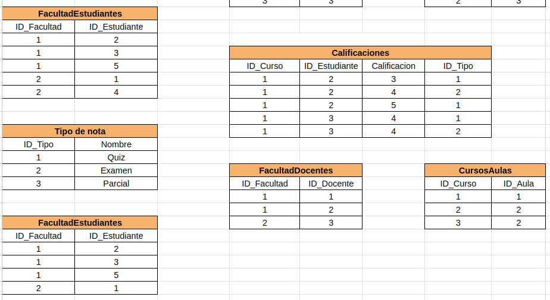

# Universidad Potaxie

## Contexto 

## Primera Forma Normal (1NF)

Para que la tabla este en 1NF, nos aseguramos que no haya datos repetidos o valores que sean compuestos en este caso fueron datos como calificaciones y tipo

## Segunda Forma Normal (2NF)

Se eliminaron las dependencias y se separó la información  en tablas independientes y cada tabla cuenta con su llave primaria 

## Tercera Forma Normal (3FN)

En esta forma no presentamos dependencias transitivas debido que en la segunda se separó bien los datos evitando estas dependencias

## Cuarta Forma Normal (4FN)

En esta forma  no se presenta tampoco dependencias multivaluada debido a que en las segunda forma crearon las tablas intermedias, un ejemplo de esto fueron las tablas facultadestudiantes y facultaddocentes

## Entidades Principales

 - **Estudiantes**: Esta entidad gestiona la información de los estudiantes registrados en el sistema, incluyendo su nombre, dirección y datos de contacto. 

  - **Cursos**: La informacion general del curso, como su duracion 

  - **Docentes**:  Esta entidad gestiona la información de los docentes registrados en el sistema, incluyendo su nombre, dirección y datos de contacto. 

  - **Facultad**: La informacion de las facultades 

  - **Calificaciones**: Maneja la información sobre las calificaciones de los estudiantes

